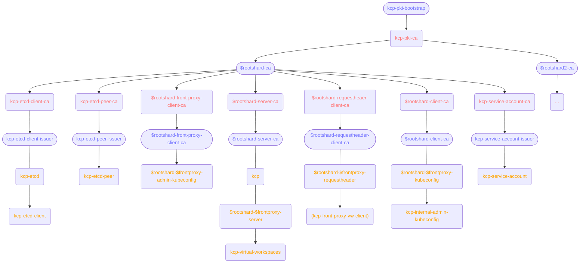

# kcp-dev/kcp-operator

[](https://goreportcard.com/report/github.com/kcp-dev/kcp-operator)
[](https://img.shields.io/github/license/kcp-dev/kcp-operator)
[](https://img.shields.io/github/v/release/kcp-dev/kcp-operator?sort=semver)
[](https://app.fossa.com/projects/git%2Bgithub.com%2Fkcp-dev%2Fkcp-operator?ref=badge_shield)

> [!WARNING]
> While kcp-operator is usable, the project is still in an early state. Please only use it if you know what you are doing. We recommend against using it in production setups right now.

kcp-operator is a Kubernetes operator to deploy and run [kcp](https://github.com/kcp-dev/kcp) instances on a Kubernetes cluster. kcp is a horizontally scalable control plane for Kubernetes-like APIs.

## Features

- [x] Create and update core components of a kcp setup (root shard, additional shards, front proxy)
- [x] Support for multi-shard deployments of kcp
- [ ] Support for a dedicated cache-server deployment not embedded in the root shard
- [x] Generate and refresh kubeconfigs for accessing kcp instances or specific shards
- [ ] Cross-namespace/-cluster setups of a multi-shard kcp deployment

## Support Matrix

The table below marks known support of a kcp version in kcp-operator versions.

| kcp    | `main`             |
| ------ | ------------------ |
| `main` | :warning: [^1]     |
| 0.27.x | :white_check_mark: |

[^1]: While we try to support kcp's `main` branch, this support is best effort and should not be used for deploying actual kcp instances.

## Installation

### Requirements

- [cert-manager](https://cert-manager.io/)


### Helm Chart

A Helm chart for kcp-operator is maintained in [kcp-dev/helm-charts](https://github.com/kcp-dev/helm-charts/tree/main/charts/kcp-operator). To install it, first add the Helm repository:

```sh
helm repo add kcp https://kcp-dev.github.io/helm-charts
```

And then install the chart:

```sh
helm upgrade --install --create-namespace --namespace kcp-operator kcp/kcp-operator kcp-operator
```

## Quickstart

### RootShard

> [!CAUTION]
> Never deploy etcd like below in production as it sets up an etcd instance without authentication or TLS.

Running a root shard requires a running etcd instance/cluster. You can set up a simple one via Helm:

```sh
$ helm install etcd oci://registry-1.docker.io/bitnamicharts/etcd --set auth.rbac.enabled=false --set auth.rbac.create=false
```

In addition, the root shard requires a reference to a cert-manager `Issuer` to issue its PKI CAs. You can create a self-signing one:

```sh
$ kubectl apply -f ./config/samples/cert-manager/issuer.yaml
```

Afterward, create the `RootShard` sample object:

```sh
$ kubectl apply -f ./config/samples/v1alpha1_rootshard.yaml
```

kcp-operator will create the necessary resources to start a `Deployment` of a kcp root shard.

## Architecture

### Certificate Management

The placeholders `$rootshard` and `$frontproxy` in the chart are used to denote the name of the corresponding operator resource.



## Contributing

Thanks for taking the time to start contributing!

### Before You Start

* Please familiarize yourself with the [Code of Conduct][4] before contributing.
* See [our contributor documentation][2] for instructions on the developer certificate of origin that we require.

### Running E2E tests locally

In order to run the E2E tests locally, you will need to setup cert-manager with the sample clusterissuer:

```sh
helm upgrade --install --namespace cert-manager --create-namespace --version v1.16.2 --set crds.enabled=true cert-manager jetstack/cert-manager
kubectl apply -n cert-manager --filename hack/ci/testdata/clusterissuer.yaml
```

### Pull Requests

* We welcome pull requests. Feel free to dig through the [issues][1] and jump in.

## Changelog

See [the list of releases][3] to find out about feature changes.

## License

This project is licensed under [Apache-2.0](./LICENSE).

[1]: https://github.com/kcp-dev/kcp-operator/issues
[2]: https://docs.kcp.io/kcp/main/contributing/getting-started/#developer-certificate-of-origin-dco
[3]: https://github.com/kcp-dev/kcp-operator/releases
[4]: https://github.com/kcp-dev/kcp/blob/main/code-of-conduct.md
