# kcp-dev/kcp-operator

This is a work-in-progress operator to deploy and manage kcp instances. Please check back later!

## Requirements

- [cert-manager](https://cert-manager.io/)

## Quickstart

### RootShard

Running a root shard requires a running etcd instance/cluster. You can set up a simple one via Helm (THIS IS INSECURE, NEVER DEPLOY ETCD LIKE THIS IN PRODUCTION):

```sh
$ helm install etcd oci://registry-1.docker.io/bitnamicharts/etcd --set auth.rbac.enabled=false --set auth.rbac.create=false
```

In addition, the root shard requires a reference to a cert-manager `Issuer` to issue its PKI CAs. You can create a self-signing one:

```sh
$ kubectl apply -f ./config/samples/cert-manager/issuer.yaml
```

Afterward, create the `RootShard` sample object:

```sh
$ kubectl apply -f ./config/samples/v1alpha1_rootshard.yaml
```

kcp-operator will create the necessary resources to start a `Deployment` of a kcp root shard.

## Architecture

### Certificate Management

The placeholders `$rootshard` and `$frontproxy` in the chart are used to denote the name of the corresponding operator resource.

```mermaid
graph TB
    A([kcp-pki-bootstrap]):::issuer --> B(kcp-pki-ca):::ca
    B --> C([$rootshard-ca]):::issuer

    C --> D(kcp-etcd-client-ca):::ca
    C --> E(kcp-etcd-peer-ca):::ca
    C --> F($rootshard-front-proxy-client-ca):::ca
    C --> G($rootshard-server-ca):::ca
    C --> H($rootshard-requestheaer-client-ca):::ca
    C --> I($rootshard-client-ca):::ca
    C --> J(kcp-service-account-ca):::ca

    D --> K([kcp-etcd-client-issuer]):::issuer
    E --> L([kcp-etcd-peer-issuer]):::issuer
    F --> M([$rootshard-front-proxy-client-ca]):::issuer
    G --> N([$rootshard-server-ca]):::issuer
    H --> O([$rootshard-requestheader-client-ca]):::issuer
    I --> P([$rootshard-client-ca]):::issuer
    J --> Q([kcp-service-account-issuer]):::issuer

    K --- K1(kcp-etcd):::cert --> K2(kcp-etcd-client):::cert
    L --> L1(kcp-etcd-peer):::cert
    M --> M1($rootshard-$frontproxy-admin-kubeconfig):::cert
    N --- N1(kcp):::cert --- N2($rootshard-$frontproxy-server):::cert --> N3(kcp-virtual-workspaces):::cert
    O --- O1($rootshard-$frontproxy-requestheader):::cert --> O2("(kcp-front-proxy-vw-client)"):::cert
    P --- P1($rootshard-$frontproxy-kubeconfig):::cert --> P2(kcp-internal-admin-kubeconfig):::cert
    Q --> Q1(kcp-service-account):::cert

    B --> R([$rootshard2-ca]):::issuer
    R --> S(...):::ca

    classDef issuer color:#77F
    classDef ca color:#F77
    classDef cert color:orange
```


