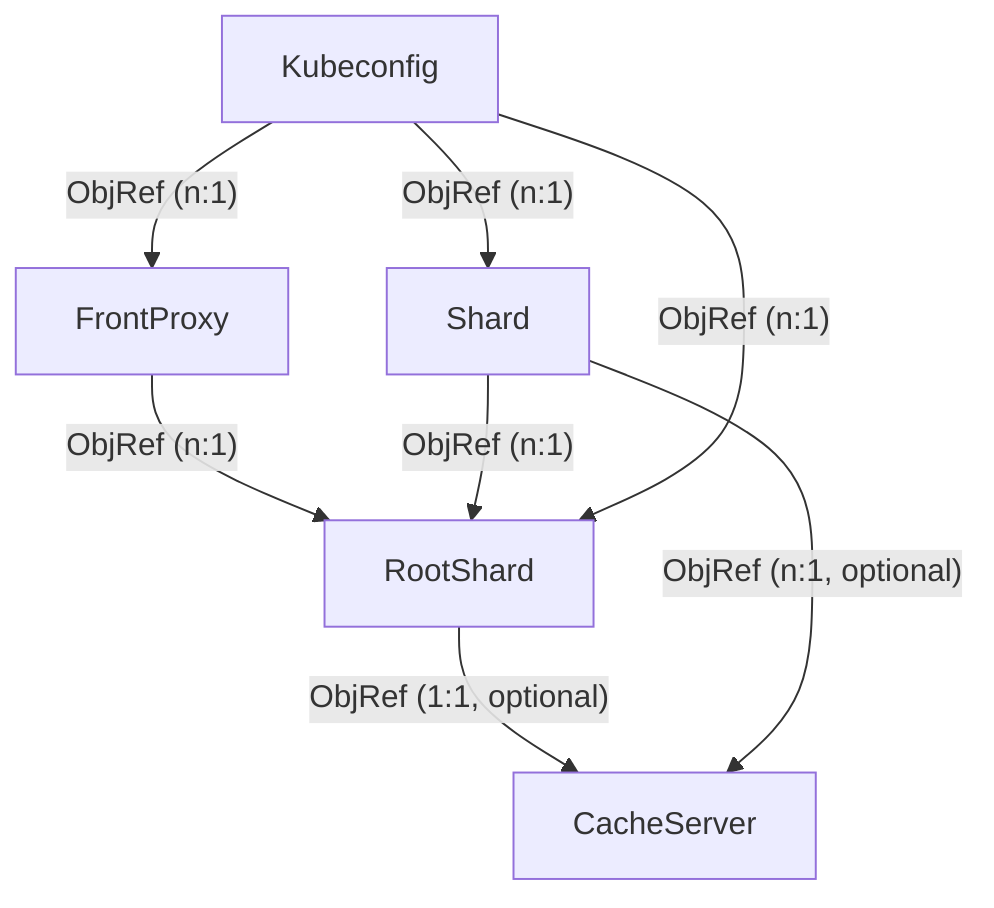

# Basics

kcp-operator ships with a number of resources that, together, can be used to create a kcp installation.

## Resource Relationships

### `RootShard` & `Shard`

Each kcp installation consists at the minimum of one root shard and one [front-proxy](front-proxy.md), but you can add additional "regular" shards to scale kcp horizontally.

Creating a new `RootShard` object means creating a new kcp installation, as you cannot have more than one root shard in one kcp installation, however multiple installations can run in the same Kubernetes namespace (though this is not necessarily recommended). The `RootShard` object's name is not really important inside kcp itself.

Each additional shard is created by creating a `Shard` object, which will reference the root shard it belongs to. Shard names are relevant in kcp, as each shard will register itself on its root shard, using the name of the `Shard` object.

### `FrontProxy`

The kcp front-proxy can be used to provide access to either a whole or a subset of a kcp installation. Its main purpose is to act as a gateway, since it builds up a runtime map of all existing workspaces across all shards that it targets, so it knows where to route a request to `/clusters/root:my-team` to the shard where the logicalcluster for that workspace resides.

A kcp installation can contain multiple front-proxies with different settings; one might perform additional authentication while another might pass unauthenticated requests to the shards (which will then perform their own authentication).

For developing controllers against kcp, it is often necessary to access the shards directly, so front-proxies are not the only way to access kcp.

### `Kubeconfig`

Kubeconfigs allow the easy creation of credentials to access kcp. As a sharded system, kcp relies on client certificate authentication and the kcp-operator will ensure the correct certificates are generated and then neatly wrapped up in ready-to-use kubeconfig Secrets.

Kubeconfigs can be configured to point to a specific shard or to a front-proxy instance, which affects which client CA is used to generate the certificates.

## Cross-Namespace/Cluster References

Due to the potential "global" nature of a kcp setup it might be necessary to run kcp-operator on multiple clusters while attempting to form one single kcp setup with multiple shards and front proxies.

To make this possible, resources with object references (see above) could have a secondary way of reading necessary configuration (instead of a `corev1.LocalObjectReference`). This could be a reference to a `ConfigMap` or a `Secret` (to be determined) which are automatically generated for various resource types. A sync process (outside of the kcp-operator) could then sync the `ConfigMap` (or the `Secret`, or a custom resource type) across namespaces or even clusters, where e.g. a `Shard` object references a `Secret` which was generated for a `RootShard` on another cluster.
