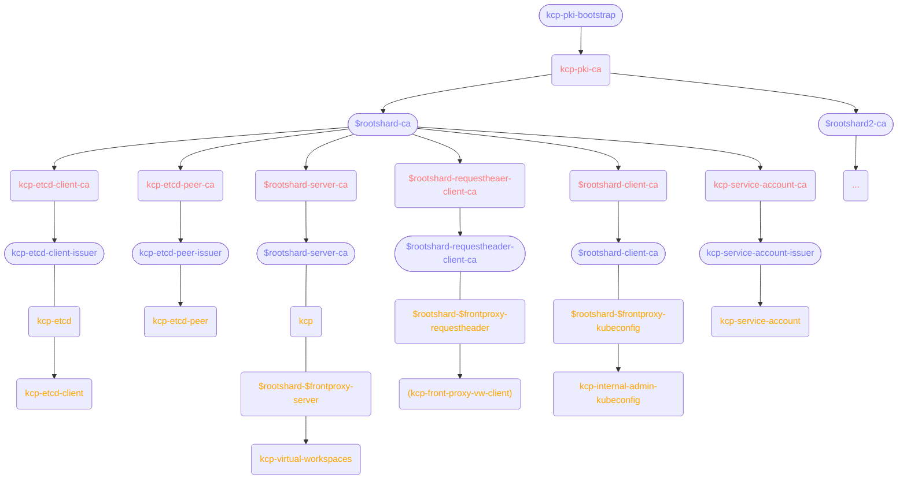

## kcp PKI

The placeholders `$rootshard` and `$frontproxy` in the chart are used to denote the name of the corresponding operator resource.



## Client CA Bundle

By default, all components in a kcp installation use the root shard's Client CA (`$rootshard-client-ca`) to authenticate client certificates. The kcp-operator generates this CA and uses it to sign all client certificates created via `Kubeconfig` objects.

However, in some scenarios you may want to accept client certificates signed by additional CAs – for example, when integrating with external identity systems or when migrating from another certificate infrastructure.

### Adding Additional Client CAs

You can configure additional client CA bundles using the `clientCABundleRef` field on various resources. This field references a Secret containing additional CA certificates that should be trusted for client authentication.

The inheritance model works as follows:

| Component | Trusted Client CAs |
|-----------|-------------------|
| **RootShard** | Root Client CA + RootShard's `clientCABundleRef` |
| **Shard** | Root Client CA + RootShard's `clientCABundleRef` + Shard's `clientCABundleRef` |
| **FrontProxy** | Root Client CA + RootShard's `clientCABundleRef` + FrontProxy's `clientCABundleRef` |
| **VirtualWorkspace** | Root Client CA + RootShard's `clientCABundleRef` + VirtualWorkspace's `clientCABundleRef` |

This means a `clientCABundleRef` configured on the `RootShard` automatically propagates to all shards, front-proxies, and virtual workspaces connected to it. Each of those components can additionally specify their own `clientCABundleRef` to trust even more CAs.

### Example

To add an additional client CA to your kcp installation:

1. Create a Secret containing the additional CA certificate:

    ```yaml
    apiVersion: v1
    kind: Secret
    metadata:
      name: external-client-ca
      namespace: my-kcp
    type: Opaque
    data:
      tls.crt: <base64-encoded-ca-certificate>
    ```

2. Reference it in your RootShard (to apply to all components):

    ```yaml
    apiVersion: operator.kcp.io/v1alpha1
    kind: RootShard
    metadata:
      name: root
      namespace: my-kcp
    spec:
      # ... other configuration ...
      clientCABundleRef:
        name: external-client-ca
    ```

    Or reference it on a specific component (e.g., a FrontProxy) to only trust it there:

    ```yaml
    apiVersion: operator.kcp.io/v1alpha1
    kind: FrontProxy
    metadata:
      name: my-frontproxy
      namespace: my-kcp
    spec:
      # ... other configuration ...
      clientCABundleRef:
        name: external-client-ca
    ```

The Secret must contain a key named `tls.crt` with PEM-encoded CA certificate(s). Multiple certificates can be concatenated in a single PEM bundle.
