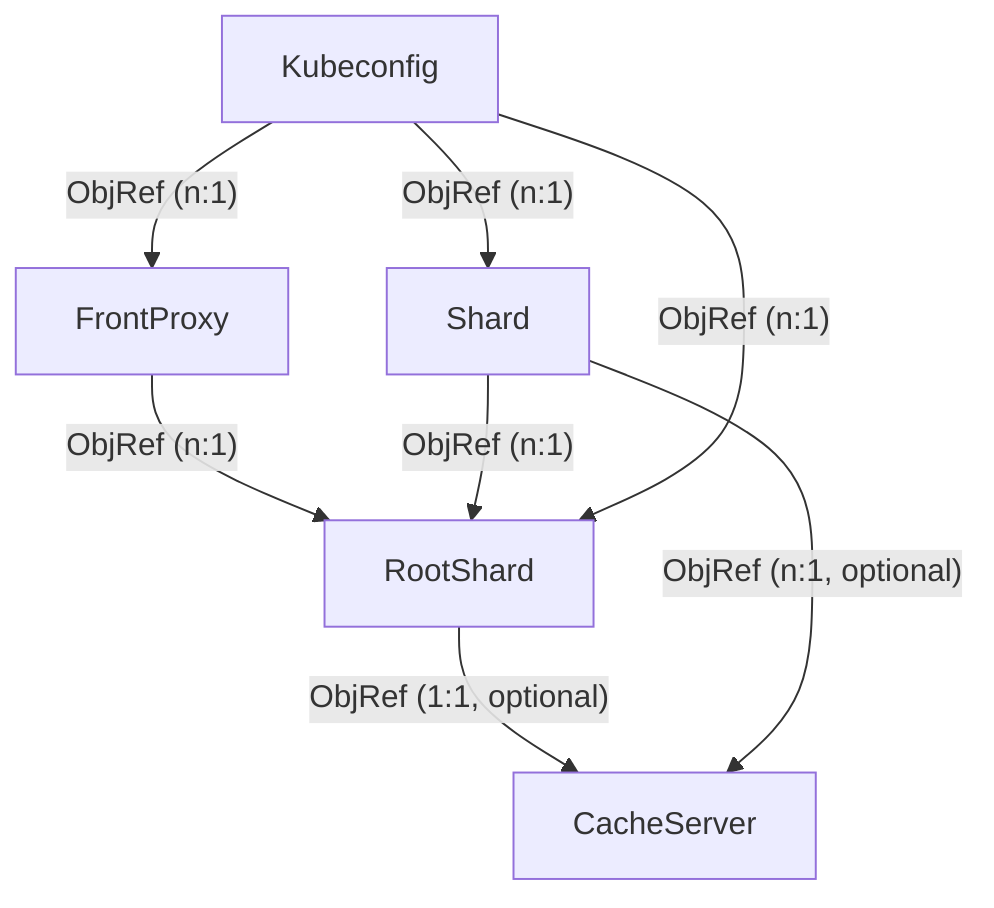

# Design Notes for kcp-operator

kcp-operator is a kubebuilder/controller-runtime based collection of controllers that allow setting up complex kcp environments.

## Resource Relationships

The above flow chart renders the following considerations:

- The `RootShard` is the nucleus of a kcp setup. Each object of this resource basically creates a new kcp setup.
- A `RootShard` has an optional dependency on a `CacheServer`, if the cache server embedded in the kcp binary is not used.
- There can be no, one or multiple kcp-front-proxy deployments that all serve traffic into the same kcp setup (e.g. because you want to run front proxies in multiple regions). The `FrontProxy` object therefore has a object reference to a `RootShard`.
- There can be one or multiple additional shards added to a kcp setup. The `Shard` object therefore has an object reference to a `RootShard`.
- `Kubeconfigs` can be generated for either a `Shard`, a `RootShard` or a `FrontProxy`. The former two are more useful for components running alongside shards (e.g. additional controllers), while the latter is useful for external access to the kcp setup.

## Cross-Namespace/Cluster References

Due to the potential "global" nature of a kcp setup it might be necessary to run kcp-operator on multiple clusters while attempting to form one single kcp setup with multiple shards and front proxies.

To make this possible, resources with object references (see above) could have a secondary way of reading necessary configuration (instead of a `corev1.LocalObjectReference`). This could be a reference to a `ConfigMap` or a `Secret` (to be determined) which are automatically generated for various resource types. A sync process (outside of the kcp-operator) could then sync the `ConfigMap` (or the `Secret`, or a custom resource type) across namespaces or even clusters, where e.g. a `Shard` object references a `Secret` which was generated for a `RootShard` on another cluster.
